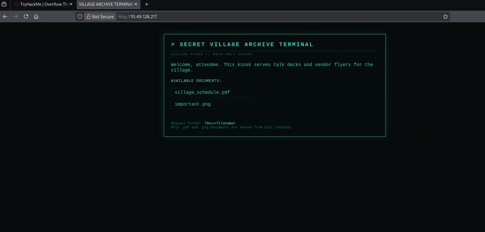
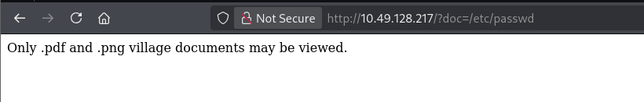
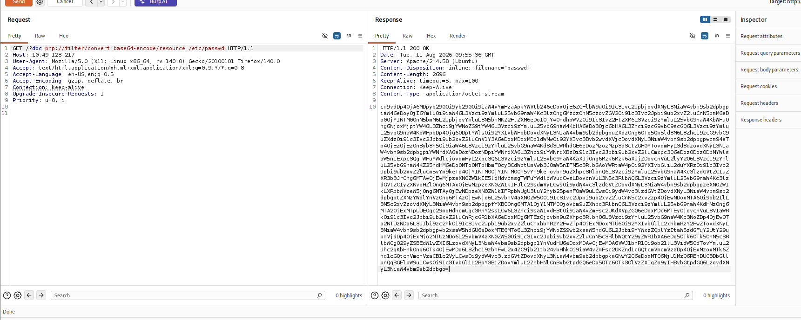
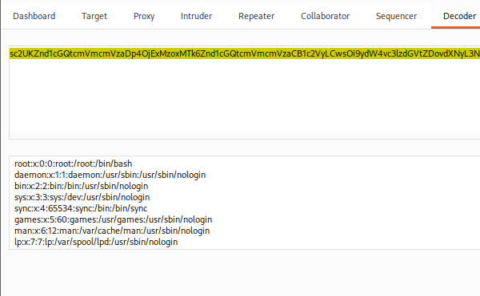
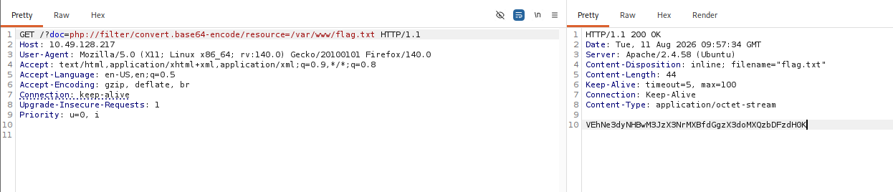

                    

## Summary

**Lost Fortune Included** is an easy web challenge from TryHackMe's *Overflow
The Jackpot* Defcon CTF event. A document-viewer parameter reads files off the
server by name but tries to restrict itself to `.pdf` and `.png`. That
extension whitelist is enforced on the *string*, not on what actually gets
read — so a **PHP filter wrapper** slips straight past it and hands back the
source of any file on disk, base64-encoded. From there it's a direct read of
the flag.

- **Vulnerability:** Local File Inclusion (LFI)
- **Bypass:** `php://filter/convert.base64-encode/resource=` defeats the extension whitelist
- **Impact:** arbitrary file read as the web user — `/etc/passwd`, app source, the flag

## Recon

Two ports, nothing exotic.

```
nmap 10.49.128.217 -p- --min-rate=2000
```

```
PORT   STATE SERVICE
22/tcp open  ssh
80/tcp open  http
```

Port 80 serves a "Secret Village Archive Terminal" — a kiosk that lists a
couple of documents and, usefully, **tells you exactly how it works**:



> Request format: `?doc=<filename>`
> Only .pdf and .png documents are served from this terminal.

A parameter whose whole job is to read a file off disk by name is the first
thing worth poking at.

## Finding the LFI

I threw the usual path-traversal payloads at `?doc=`:

- `?doc=/etc/passwd`
- `?doc=../../../../etc/passwd`
- `?doc=....//....//....//....//etc/passwd`

All of them came back with the same refusal:



Appending `.pdf` to satisfy the filter didn't help either — the file it then
tried to read doesn't exist. So the traversal itself is fine; the block is
purely the **extension check** on the end of the string. That's the thing to
get around, not the path.

## Confirming it — the PHP filter wrapper

The whitelist only inspects the requested name. A **PHP filter wrapper**
changes *how* the file is read without ever ending in `.pdf` or `.png`, so the
check has nothing to grab onto:

```
?doc=php://filter/convert.base64-encode/resource=/etc/passwd
```

I sent it through Burp Repeater. `200 OK`, and a wall of base64 in the
response:



Dropping that into Burp's Decoder confirms it — this is `/etc/passwd`, read
straight off the box:



Why base64 and not the file directly? A raw read of a `.php` file would get
*executed* by the server, and you'd see its output, not its code. The
`convert.base64-encode` filter forces PHP to hand back the file's raw bytes
instead of running them — which is what makes this technique read *source*,
not just flat text files.

## Getting the flag

Same wrapper, pointed at the flag:

```
?doc=php://filter/convert.base64-encode/resource=/var/www/flag.txt
```



Base64-decode the response:

```
echo '<base64 from the response>' | base64 -d
```

```
THM{[REDACTED — go get it yourself]}
```

The flag itself names the lesson.

## What tripped me up

I burned the first few minutes on traversal payloads — `../`, the
`....//` filter-bypass variant, the whole list — because a refusal *looks*
like the traversal is being blocked. It wasn't. The path was reaching the
target the whole time; the server was only ever rejecting the **extension**.
Once I re-read the refusal as "your filename didn't end in `.pdf`/`.png`"
rather than "traversal denied," the wrapper was the obvious move. Lesson:
read what the block is actually checking before you escalate the payload.

## Remediation

The bug is trusting user input to name a file at all. In order of preference:

- **Don't pass user input to the filesystem.** Map `?doc` to an allowlist of
  known IDs (`?doc=1` → a fixed server-side path), never to a raw filename.
- If a filename must be used, resolve the final real path and confirm it stays
  inside the intended directory (`realpath()` starts with the docroot) —
  *after* stripping wrappers and traversal.
- Explicitly reject stream wrappers (`php://`, `phar://`, `data://`); allow
  `php://` nowhere near a file-read parameter.
- Validate by what the file **is**, not what its name ends in. An extension
  whitelist that only reads the string is theatre.
