            

## Summary

**Red** is an easy linux and web challenge from tryhackme. The page parameter leads to lfi via php wrapper
 to gain initial foothold using a users **Bash_history** to generate a wordlist & brute force
to get access via ssh. leading to escalation to a higher privileged user and finally root via suid on an outdated binary.

- **Vulnerabilities** : LFI , Outdated Binary 
- **Bypass** : Php wrapper , CVE-2021-4034

## Recon

```
nmap -p- 10.49.159.228
```

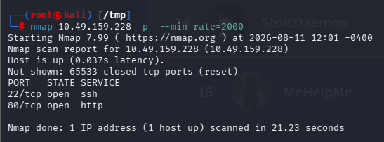

Port 80 was running a web server so i decided to check it out
Found a parameter **?page=** requesting files from the server without user input sanitization

## Exploiting The LFI 
I tried usual path-traversal payloads on the **?page=** parameter

- `?page=/etc/passwd`
- `?page=../../../../etc/passwd`
- `?page=....//...//...//...//etc/passwd`

but these didnt work, so i decided to try php wrappers 

```
?page=php://filter/convert.base64-encode/resource=/etc/passwd 
```
It worked Got the contents of /etc/passwd file.
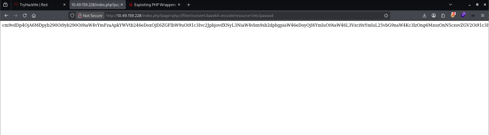

Now lets decode the base64 encoded data 

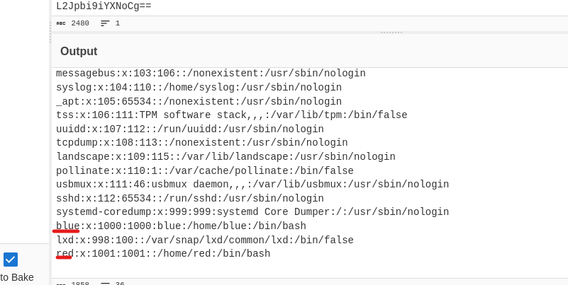

Found two users red and blue, Enumerated the System and found something interesting in blue's history

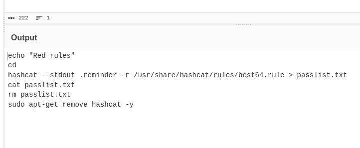

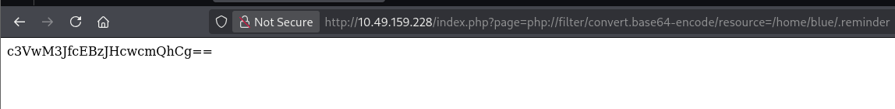

Got the content from the **.reminder** file and then i decided to run the same command on my system
creating a wordlist using **hashcat best64 rule**

Unfortunately i didnt had this rule on my machine by default so i downloaded it from offical repo
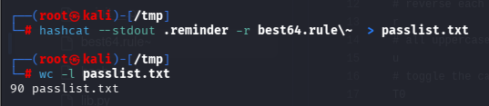

Wordlist is ready, Since port 22 ssh was open i decided to brute force on blue using the wordlist

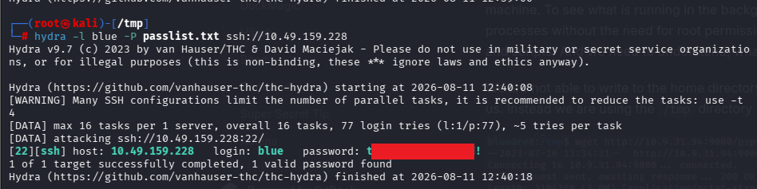

Got the shell and first flag 

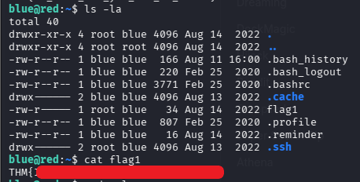

While i was enumerating system,i saw some random messages were popping up from Red
and eventually red terminated my ssh session

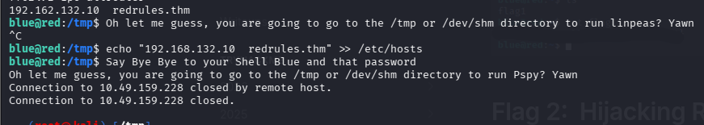

I tried to log back in the system using ssh and same password
but the password was changed by a script made by red.

I used hydra again to bruteforce ssh using same wordlist
got the password but it was different this time
So basically the script changes the password from the wordlist to anything random

Got in the shell again and ran **pspy64** and found something interesting

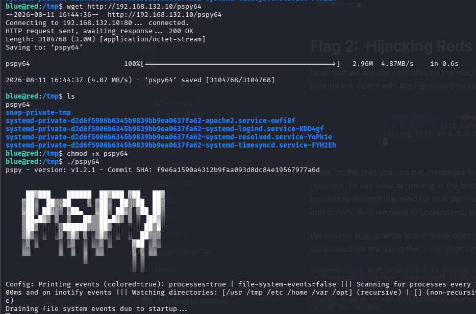

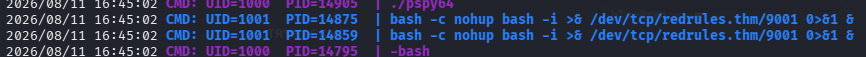

It was red's reverse shell connecting to **redrules.thm**.
Next we start a listner on port 9001 and rewrite the hosts file by resolving
**redrules.thm** to our attacker machine's ip.

I realized that file editors like nano,vim gives us history error when we try to write the file
So i used this command:
```
echo "<YOUR IP> redrules.thm" | tee -a /etc/hosts

```
Here, echo "YOUR_IP redrules.thm" creates the text we want to append to the /etc/hosts file. This text is piped to tee -a /etc/hosts which, due to the -a (append) option, adds the line to the end of the /etc/hosts file

and finally we caught the shell as red and got the 2nd flag
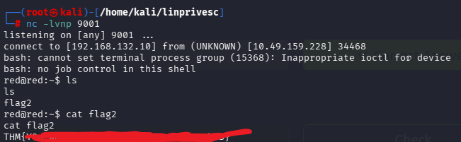

## Privilege Escalation

After enumerating the system i found SUID bit on a binary
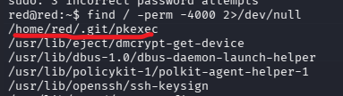

Now i ran the **--version** check on the binary.

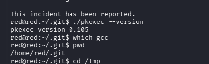

The present pkexec verion was vulenrable to **CVE-2021-4034** - LOCAL PRIVILEGE ESCALATION

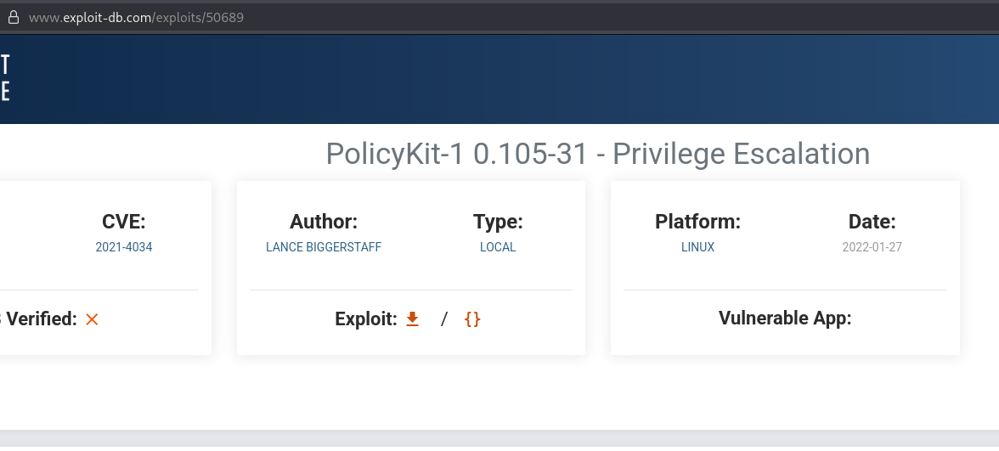

Since There was no gcc compiler on the machine,
I decided to look for a python script to exploit this vulnerability

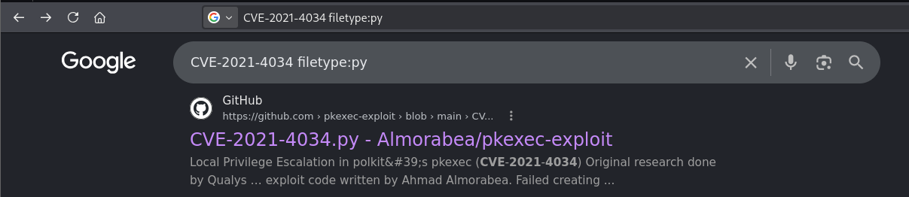

Downloaded the script on attacker machine,but there's something we gotta change in the script

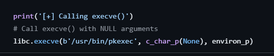

As you see the script by default is executing the binary from a different location

in our case the binary is located in **/home/red/.git/pkexec**. We changed the path
and executed the script in our target machine 

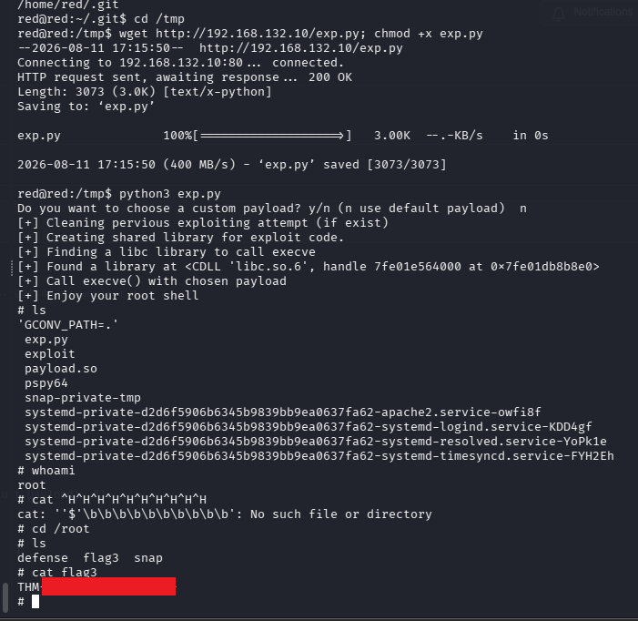

Got the shell and flag. It was an interesting room.
## Remediation

Every step in this chain was a fixable misconfiguration. In order of the attack:

- **The LFI.** Don't hand user input to the filesystem. Map `?page` to an
  allowlist of known IDs (`?page=1` → a fixed server-side path), never to a raw
  filename. If a path must be built from input, resolve it and confirm it stays
  inside the intended directory *after* stripping wrappers and traversal, and
  disable PHP stream wrappers near file reads (`allow_url_include=Off`, a tight
  `open_basedir`). An extension check on the string alone is theatre — the
  wrapper never ends in `.pdf`.
- **Secrets in readable history.** `blue`'s shell history and the `.reminder`
  file handed over exactly how the password was generated. Don't leave
  credentials or password recipes in world-readable files; lock down home-dir
  permissions, and don't derive passwords from a public wordlist + a known rule
  — that's what made the brute force finish in seconds.
- **SSH brute force.** Key-only auth (`PasswordAuthentication no`), plus
  `fail2ban` or rate limiting, closes the Hydra step even if a weak password
  survives.
- **The malicious cron / hosts poisoning.** A scheduled job running as `red`
  reached out to a *resolvable hostname* (`redrules.thm`) that a lower-priv user
  could repoint — and `/etc/hosts` was writable by that user. Neither should be
  true: scheduled tasks shouldn't connect to attacker-influenceable names (pin
  an IP, or authenticate the endpoint), and `/etc/hosts` must be root-owned and
  root-writable only.
- **PwnKit (CVE-2021-4034).** The box shipped an outdated, SUID `pkexec`. Patch
  polkit, and audit for stray SUID binaries — the vulnerable copy sitting in
  `/home/red/.git/pkexec` had no business being SUID at all. `find / -perm -4000`
  should return a short, deliberate list.

---

